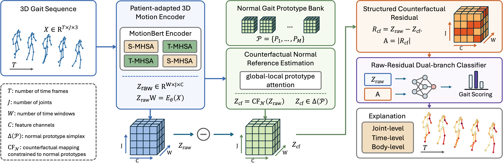
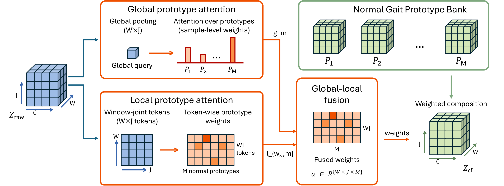
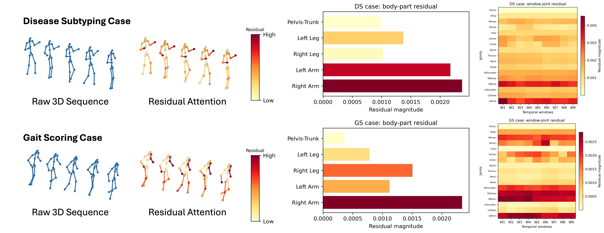

# ProCoRe-Gait


Official code organization for **ProCoRe-Gait**, a prototype-constrained counterfactual residual learning framework for interpretable pathological gait analysis.

ProCoRe-Gait constructs an individualized counterfactual normal reference from a compact normal-gait prototype bank, represents pathology as a structured raw-normal residual, and uses the same residual tensor for gait scoring, dementia subtyping, and multi-level abnormality explanation.

## Framework

<p align="center">
  
</p>

## Prototype-Constrained Reference Estimation

<p align="center">
  
</p>

## Residual-Based Explanation

<p align="center">
  
</p>

## Repository Layout

```text
ProCoRe-Gait/
├── assets/                  # GitHub homepage figures: FIG1, FIG2, FIG4
├── configs/                 # Core pretraining/adaptation and body-part configs
├── const/                   # Project constants
├── lib/                     # Motion encoder, data utilities, learning utilities
├── tools/                   # Core training, evaluation, feature extraction scripts
├── pretrain_motionbert.py   # Encoder pretraining/adaptation entry
├── preprocess_amass.sh      # AMASS preprocessing helper
├── pretrain.sh              # Normal-motion encoder pretraining helper
└── pretrain_amass.sh        # Patient-adapted encoder helper
```

This public project intentionally excludes datasets, checkpoints, smoke tests, temporary sweep scripts, local logs, and non-standard evaluation folders.

## Installation

```bash
conda create -n procore-gait python=3.9 -y
conda activate procore-gait
pip install -r requirements.txt
```

## Data Preparation

The code expects externally downloaded datasets. Place them under local data folders such as:

```text
Dataset/
data/
features/
checkpoint/
```

These folders are ignored by Git and should not be committed.

For AMASS preprocessing:

```bash
bash preprocess_amass.sh
```

For PDGait and 3DGait preprocessing, see:

```text
lib/data/pdgait/
lib/data/3dgait/
```

## Core Pipeline

Pretrain the normal-motion encoder:

```bash
bash pretrain.sh
```

Adapt the encoder to gait clips:

```bash
bash pretrain_amass.sh
```

Extract latent features:

```bash
python tools/extract_motionbert_latents.py --help
python tools/extract_window_joint_features.py --help
```

Build prototype-constrained residual features:

```bash
python tools/evaluate_main_protocol_from_latents.py --help
python tools/build_window_joint_residuals.py --help
```

Train downstream ProCoRe-Gait classifiers:

```bash
python tools/train_pdgait_counterfactual_attention.py --help
python tools/train_pdgait_score3_dppd_aligned.py --help
python tools/train_3dgait_cf_extended.py --help
```

## Notes

The current release is organized for paper maintenance and reproducible code release. Exact dataset paths, pretrained checkpoints, and fold split files should be configured locally according to the dataset licenses and experimental protocol.

## Citation

The citation will be updated after the paper is publicly available.
